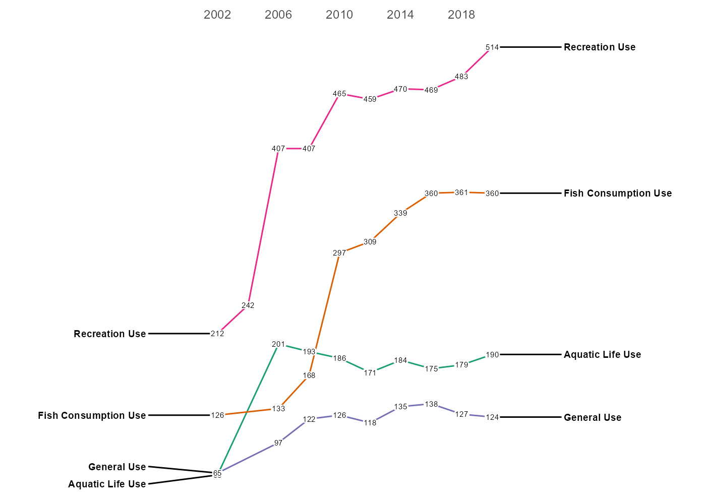

<!-- README.md is generated from README.Rmd. Please edit that file -->

# rATTAINS

<!-- badges: start -->
<!-- badges: end -->

Work in progress, probably don’t use.

Install from Github

``` r
install.packages("remotes")
remotes::install_github("mps9506/rATTAINS")
```

examples:

``` r
library(rATTAINS)
df <- state_summary(organization_id = "TCEQMAIN", reporting_cycle = "2020")
str(df)
#> tibble[,16] [645 x 16] (S3: tbl_df/tbl/data.frame)
#>  $ organization_identifier       : chr [1:645] "TCEQMAIN" "TCEQMAIN" "TCEQMAIN" "TCEQMAIN" ...
#>  $ organization_name             : chr [1:645] "Texas" "Texas" "Texas" "Texas" ...
#>  $ organization_type_text        : chr [1:645] "State" "State" "State" "State" ...
#>  $ reporting_cycle               : chr [1:645] "2008" "2008" "2008" "2008" ...
#>  $ water_type_code               : chr [1:645] "OCEAN" "OCEAN" "OCEAN" "OCEAN" ...
#>  $ units_code                    : chr [1:645] "Square Miles" "Square Miles" "Square Miles" "Square Miles" ...
#>  $ use_name                      : chr [1:645] "Aquatic Life Use" "PRIMARY RECREATION/SWIMMING" "OYSTER AQUATIC LIFE" "Fish Consumption Use" ...
#>  $ parameter_group               : chr [1:645] NA NA NA "MERCURY" ...
#>  $ cause                         : num [1:645] NA NA NA 3879 NA ...
#>  $ cause_count                   : int [1:645] NA NA NA 10 NA 2 NA NA 1 NA ...
#>  $ meeting_criteria              : num [1:645] NA NA NA NA NA NA NA NA NA NA ...
#>  $ meeting_criteria_count        : int [1:645] NA NA NA NA NA NA NA NA NA NA ...
#>  $ insufficient_information      : num [1:645] NA NA NA NA NA NA NA NA NA NA ...
#>  $ insufficient_information_count: int [1:645] NA NA NA NA NA NA NA NA NA NA ...
#>  $ removed                       : num [1:645] NA NA NA NA NA NA NA NA NA NA ...
#>  $ removed_count                 : int [1:645] NA NA NA NA NA NA NA NA NA NA ...
```

``` r
library(dplyr)
#> 
#> Attaching package: 'dplyr'
#> The following objects are masked from 'package:stats':
#> 
#>     filter, lag
#> The following objects are masked from 'package:base':
#> 
#>     intersect, setdiff, setequal, union
library(ggplot2)
library(ggrepel)


df %>% 
  mutate(reporting_cycle = as.numeric(reporting_cycle),
         cause_count = as.numeric(cause_count)) %>%
  group_by(reporting_cycle, use_name) %>%
  summarise(count = sum(cause_count, na.rm = TRUE)) %>%
  ungroup() %>%
  filter(!is.na(use_name)) %>%
  filter(use_name != "NONCONTACT RECREATION USE",
           use_name != "OVERALL USE SUPPORT") %>%
  mutate(use_name = case_when(
    use_name == "CONTACT RECREATION USE" ~ "Recreation Use",
    use_name == "CONTACT RECREATION" ~ "Recreation Use",
    use_name == "PRIMARY RECREATION/SWIMMING" ~ "Recreation Use",
    use_name != "PRIMARY RECREATION/SWIMMING" |
      use_name != "CONTACT RECREATION USE" |
      use_name != "CONTACT RECREATION" ~ use_name)) %>%
  filter(use_name %in% c("Recreation Use", "Fish Consumption Use", "Aquatic Life Use", "General Use"))-> plot_df
#> `summarise()` has grouped output by 'reporting_cycle'. You can override using the `.groups` argument.

ggplot(plot_df, aes(x = reporting_cycle, y = count, group = use_name)) +
  geom_line(aes(color = use_name)) +
  geom_text_repel(data = plot_df %>% filter(reporting_cycle==2020),
                  aes(label = use_name),
                  size = 2.5,
                  hjust = "left",
                  fontface="bold",
                  direction= "y",
                  nudge_x = 5)+
  geom_text_repel(data = plot_df %>% filter(reporting_cycle==2002),
                  aes(label = use_name),
                  size = 2.5,
                  hjust = "right",
                  fontface="bold",
                  direction= "y",
                  nudge_x = -5)+
  geom_label(aes(label = count),
             size = 2,
             label.padding = unit(0.05, "lines"), 
             label.size = 0.0) +
  scale_x_continuous(position = "top",
                     breaks = c(2002,2006,2010,2014,2018),
                     expand = expansion(mult = 0.75)) +
  scale_color_brewer(palette = "Dark2") +
  theme_bw() +
  theme(axis.ticks = element_blank(),
        axis.title.y = element_blank(),
        axis.title.x = element_blank(),
        axis.text.y = element_blank(),
        legend.position = "none",
        panel.border = element_blank(),
        panel.grid.major.x = element_blank(),
        panel.grid.minor.x = element_blank(),
        panel.grid.major.y = element_blank(),
        panel.grid.minor.y = element_blank()
        )
```



``` r
df <- huc12_summary(huc = "020700100204")
str(df)
#> List of 7
#>  $ huc_summary        : tibble[,14] [1 x 14] (S3: tbl_df/tbl/data.frame)
#>   ..$ huc12                                         : chr "020700100204"
#>   ..$ assessment_unit_count                         : int 20
#>   ..$ total_catchment_area_sq_mi                    : num 46.2
#>   ..$ total_huc_area_sq_mi                          : num 46.2
#>   ..$ assessed_catchment_area_sq_mi                 : num 44.1
#>   ..$ assessed_catchment_area_percent               : num 95.4
#>   ..$ assessed_good_catchment_area_sq_mi            : num 1.77
#>   ..$ assessed_good_catchment_area_percent          : num 3.83
#>   ..$ assessed_unknown_catchment_area_sq_mi         : int 0
#>   ..$ assessed_unknown_catchment_area_percent       : int 0
#>   ..$ contain_impaired_waters_catchment_area_sq_mi  : num 44.1
#>   ..$ contain_impaired_waters_catchment_area_percent: num 95.4
#>   ..$ contain_restoration_catchment_area_sq_mi      : num 44.1
#>   ..$ contain_restoration_catchment_area_percent    : num 95.4
#>  $ au_summary         : tibble[,1] [20 x 1] (S3: tbl_df/tbl/data.frame)
#>   ..$ assessment_unit_id: chr [1:20] "MD-ANATF-02140205" "MD-02140205-Northwest_Branch" "MD-02140205" "DCTFD01R_00" ...
#>  $ ir_summary         : tibble[,4] [3 x 4] (S3: tbl_df/tbl/data.frame)
#>   ..$ epa_ir_category_name  : chr [1:3] "1" "4A" "5"
#>   ..$ catchment_size_sq_mi  : num [1:3] 1.77 25.35 37.89
#>   ..$ catchment_size_percent: num [1:3] 3.83 54.81 81.93
#>   ..$ assessment_unit_count : int [1:3] 2 11 7
#>  $ use_summary        : tibble[,6] [13 x 6] (S3: tbl_df/tbl/data.frame)
#>   ..$ use_name              : chr [1:13] "Aquatic Life and Wildlife" "Fishing" "Fishing" "Navigation" ...
#>   ..$ use_group_name        : chr [1:13] "ECOLOGICAL_USE" "FISHCONSUMPTION_USE" "FISHCONSUMPTION_USE" "OTHER_USE" ...
#>   ..$ use_attainment        : chr [1:13] "Not Supporting" "Fully Supporting" "Not Supporting" "Fully Supporting" ...
#>   ..$ catchment_size_sq_mi  : num [1:13] 19.49 1.77 1.91 22.78 1.91 ...
#>   ..$ catchment_size_percent: num [1:13] 42.14 3.83 4.14 49.26 4.13 ...
#>   ..$ assessment_unit_count : int [1:13] 1 2 4 3 1 13 13 1 12 1 ...
#>  $ param_summary      : tibble[,4] [17 x 4] (S3: tbl_df/tbl/data.frame)
#>   ..$ parameter_group_name  : chr [1:17] "ALGAL GROWTH" "CHLORINE" "HABITAT ALTERATIONS" "HYDROLOGIC ALTERATION" ...
#>   ..$ catchment_size_sq_mi  : num [1:17] 22.8 10.7 25.3 36.5 22.8 ...
#>   ..$ catchment_size_percent: num [1:17] 49.3 23.2 54.7 79 49.3 ...
#>   ..$ assessment_unit_count : int [1:17] 2 1 3 6 9 4 3 8 15 11 ...
#>  $ res_plan_summary   : tibble[,4] [1 x 4] (S3: tbl_df/tbl/data.frame)
#>   ..$ summary_type_name     : chr "TMDL"
#>   ..$ catchment_size_sq_mi  : num 26.4
#>   ..$ catchment_size_percent: num 57.1
#>   ..$ assessment_unit_count : int 15
#>  $ vision_plan_summary: tibble[,4] [1 x 4] (S3: tbl_df/tbl/data.frame)
#>   ..$ summary_type_name     : chr "TMDL"
#>   ..$ catchment_size_sq_mi  : num 26.4
#>   ..$ catchment_size_percent: num 57.1
#>   ..$ assessment_unit_count : int 15
```
